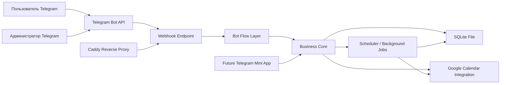

# Стек используемых технологий

## 1. Назначение документа

Этот документ фиксирует утвержденный технологический стек проекта, причины выбора, сравнение с альтернативами, архитектурный подход и требования к серверу.

Связанные документы:
- `ТЗ, Техническое задание.md` — полный продуктовый и функциональный контекст проекта.
- `План, Этапы разработки.md` — только этапы реализации, проверки и критерии завершения.

## 2. Зафиксированный стек проекта

### 2.1 Итоговый стек

- Runtime: `Node.js LTS`
- Язык: `TypeScript`
- Backend framework: `NestJS`
- Telegram bot framework: `grammY`
- База данных: `SQLite`
- ORM / схема данных: `Prisma`
- Интеграция с Google: `Google OAuth 2.0 + Google Calendar API + googleapis`
- Фоновые задачи: `встроенный scheduler backend`
- Логирование: `structured JSON logs`
- Деплой: `Docker Compose`
- Reverse proxy / HTTPS: `Caddy`

### 2.2 Почему этот стек утвержден

- Он соответствует текущему масштабу проекта.
- Он остается достаточно простым для AI-assisted разработки.
- Он не требует дорогой инфраструктуры.
- Он позволяет развернуть проект на одном VPS.
- Он сохраняет архитектурный задел под будущий Telegram Mini App.
- Он дает нормальную типизацию и контроль качества без лишней сложности.

## 3. Как выбирался стек

Стек выбирался по следующим критериям:
- соответствие ТЗ;
- низкая инфраструктурная сложность;
- удобство разработки вместе с AI;
- понятная структура проекта;
- удобная проверка и отладка;
- пригодность к будущему расширению без переписывания ядра.

## 4. Сравнение технологий и итоговый выбор

### 4.1 Runtime и основной язык

#### Вариант A. Node.js + TypeScript

Плюсы:
- сильная экосистема для Telegram и Google API;
- типизация уменьшает число ошибок в AI-generated коде;
- удобно развивать единый backend под бота и будущий Mini App;
- хорошая совместимость с Docker и VPS.

Минусы:
- требует архитектурной дисциплины;
- без нормального каркаса может быстро превратиться в хаотичный код.

Решение:
- это основной и утвержденный вариант.

#### Вариант B. Python + FastAPI

Плюсы:
- очень быстрый старт;
- простой входной порог;
- хорош для прототипов и API.

Минусы:
- хуже подходит для единого технологического контура с будущим Mini App;
- меньше пользы от строгой типизации;
- выше риск тихих ошибок в предметной логике при AI-assisted разработке.

Решение:
- не берем как основной стек.

#### Вариант C. Go

Плюсы:
- высокая производительность;
- удобные бинарные деплои.

Минусы:
- избыточен для текущей нагрузки;
- slower time-to-market для такого проекта;
- меньше практической выгоды для вашего сценария.

Решение:
- не берем.

### 4.2 Backend framework

#### Вариант A. NestJS

Плюсы:
- модульная структура;
- удобно разделять Telegram-слой, бизнес-логику, интеграции и хранение;
- хорошо подходит для поэтапной разработки;
- удобен для будущего Mini App.

Минусы:
- тяжелее простого Express/Fastify;
- входной порог немного выше.

Решение:
- это основной и утвержденный вариант.

#### Вариант B. Express / Fastify без жесткого каркаса

Плюсы:
- проще старт;
- меньше абстракций.

Минусы:
- выше риск смешать Telegram handlers и бизнес-логику;
- сложнее держать проект в порядке на нескольких итерациях.

Решение:
- не берем как основной вариант.

### 4.3 Telegram bot framework

#### Вариант A. grammY

Плюсы:
- хорошо сочетается с TypeScript;
- удобен для inline-кнопок и callback-flow;
- подходит для webhook-модели;
- хорошо ложится на сценарии пошаговой навигации.

Минусы:
- в интернете старых примеров меньше, чем у Telegraf.

Решение:
- это основной и утвержденный вариант.

#### Вариант B. Telegraf

Плюсы:
- зрелый инструмент;
- много примеров.

Минусы:
- для нового проекта на TypeScript я считаю grammY более аккуратной основой.

Решение:
- не берем как основной вариант.

### 4.4 База данных

#### Вариант A. SQLite

Плюсы:
- максимально простой старт;
- не нужен отдельный сервер базы данных;
- данные лежат в одном локальном файле;
- меньше нагрузка на VPS;
- дешевле и проще эксплуатация;
- подходит для одного экземпляра приложения и маленькой нагрузки.

Минусы:
- хуже подходит для высокой конкуренции на запись;
- если проект сильно вырастет, может понадобиться миграция на PostgreSQL.

Решение:
- это основной и утвержденный вариант.

#### Вариант B. PostgreSQL

Плюсы:
- надежный production-вариант;
- лучше для сложных и конкурентных сценариев;
- лучше подходит для будущего роста.

Минусы:
- отдельный сервис;
- сложнее деплой;
- лишняя сложность для текущего масштаба проекта.

Решение:
- не берем в MVP.

### 4.5 ORM и схема данных

#### Вариант A. Prisma

Плюсы:
- понятная схема данных;
- быстрый старт;
- удобно проверять связи и структуру;
- хорошо подходит для AI-assisted разработки.

Минусы:
- в очень сложных SQL-сценариях бывает менее гибким.

Решение:
- это основной и утвержденный вариант.

#### Вариант B. TypeORM

Плюсы:
- известный инструмент;
- много материалов.

Минусы:
- больше спорной магии;
- хуже предсказуемость сопровождения.

Решение:
- не берем.

#### Вариант C. Drizzle

Плюсы:
- хороший контроль;
- современный инструмент.

Минусы:
- для текущего проекта не дает заметного выигрыша перед Prisma;
- требует более явного проектирования на раннем этапе.

Решение:
- не берем.

### 4.6 Интеграция с Google

#### Утвержденный вариант

- `Google OAuth 2.0`
- `Google Calendar API`
- `googleapis`

Почему:
- это официальный путь;
- он покрывает free/busy, создание событий, Google Meet, гостей, отмену и изменение событий;
- меньше риск проблем при сопровождении.

### 4.7 Фоновые задачи

#### Вариант A. Встроенный scheduler

Плюсы:
- достаточен для TTL заявок, очистки данных и служебных проверок;
- не требует Redis и очередей;
- проще эксплуатация.

Минусы:
- не так мощен, как отдельная система очередей.

Решение:
- это основной и утвержденный вариант.

#### Вариант B. BullMQ + Redis

Плюсы:
- мощная модель очередей;
- хорошие ретраи и управление задачами.

Минусы:
- отдельный сервис;
- избыточность для MVP.

Решение:
- не берем.

### 4.8 Логирование

#### Вариант A. Structured JSON logs

Плюсы:
- проще искать ошибки;
- удобнее читать логи в Docker и на VPS;
- удобно связывать действия по booking ID и operation ID.

Минусы:
- визуально менее “человечные”, чем простые console logs.

Решение:
- это основной и утвержденный вариант.

#### Вариант B. Только console log

Плюсы:
- просто.

Минусы:
- неудобно диагностировать ошибки в production;
- плохо подходит для Telegram webhook и Google integration.

Решение:
- не берем.

### 4.9 Деплой

#### Вариант A. Docker Compose + Caddy

Плюсы:
- простой деплой на VPS;
- легко воспроизводить окружение;
- Caddy упрощает HTTPS и reverse proxy;
- удобно хранить SQLite-файл в volume.

Минусы:
- требует базового понимания контейнеров.

Решение:
- это основной и утвержденный вариант.

#### Вариант B. PM2 + Nginx

Плюсы:
- рабочий и привычный вариант.

Минусы:
- больше ручной настройки;
- выше риск дрейфа окружения.

Решение:
- не берем как основной.

## 5. Архитектура решения

### 5.1 Главный принцип

Telegram-бот не должен содержать внутри себя основную бизнес-логику. Бизнес-логика должна жить в отдельном core-слое, чтобы потом Mini App можно было подключить к тому же backend.

### 5.2 Логическая схема

### 5.3 Основные backend-модули

- `Bot Flow Module` — меню, кнопки, навигация, маршрутизация действий.
- `Booking Module` — заявки, статусы, отмена, перенос, связь с календарными событиями.
- `Availability Module` — расчет доступных дат и слотов.
- `Google Calendar Module` — OAuth, free/busy, события, Meet, гости, отмены.
- `User Module` — Telegram-профиль, email, ban/unban.
- `Admin Module` — настройки, blacklist, шаблоны, список заявок.
- `Scheduler Module` — TTL, очистка старых данных, служебные проверки.
- `Logging Module` — системные и бизнес-логи.

### 5.4 Что важно для будущего Mini App

- core-логика не должна зависеть от Telegram handlers;
- данные, правила и статусы должны быть едиными;
- Mini App в будущем должен использовать тот же backend.

## 6. Логирование

### 6.1 Что логируем

- старт приложения;
- ошибки конфигурации;
- входящие Telegram update;
- ошибки webhook;
- переходы bot-flow;
- создание, подтверждение, отклонение, истечение и отмену заявок;
- резервирование и снятие резерва;
- ban / unban;
- OAuth Google;
- free/busy запросы;
- создание и отмену событий;
- фоновые задачи;
- очистку старых данных.

### 6.2 Обязательные поля логов

- `timestamp`
- `level`
- `context`
- `message`
- `operation_id`
- `user_telegram_id`, если применимо
- `update_id`, если применимо
- `booking_id`, если применимо
- `calendar_event_id`, если применимо
- `error_code` и `error_message` при ошибках

## 7. Требования к серверу

### 7.1 Минимальный сервер

- `1 vCPU`
- `2 GB RAM`
- `20-25 GB SSD`

Подходит, если:
- размещается только этот проект;
- нет большого числа дополнительных ботов;
- используется один экземпляр приложения.

### 7.2 Рекомендуемый сервер

- `2 vCPU`
- `4 GB RAM`
- `30-40 GB SSD`

Почему это лучше:
- есть запас на Docker, Caddy, backend, логи и SQLite;
- можно разместить еще несколько простых ботов;
- меньше риск упереться в память.

### 7.3 Важные правила для SQLite

- файл базы должен храниться вне контейнера;
- файл базы должен лежать в примонтированной директории;
- приложение должно работать в одном экземпляре;
- нужно предусмотреть простое резервное копирование файла базы.

## 8. Окончательно утвержденные решения

- База данных: `SQLite`
- Backend: `NestJS`
- Telegram framework: `grammY`
- Хранение данных: `Prisma + SQLite file`
- Deploy: `Docker Compose + Caddy`
- Режим работы: `один экземпляр приложения на одном VPS`

## 9. Источники

- Node.js LTS: https://nodejs.org/en/about/previous-releases
- NestJS: https://docs.nestjs.com/
- NestJS logging: https://docs.nestjs.com/techniques/logger
- NestJS task scheduling: https://docs.nestjs.com/techniques/task-scheduling
- grammY: https://grammy.dev/guide/
- Telegram Bot API: https://core.telegram.org/bots/api
- Prisma SQLite quickstart: https://www.prisma.io/docs/getting-started/quickstart-sqlite
- SQLite docs: https://www.sqlite.org/docs.html
- Google OAuth for web server apps: https://developers.google.com/identity/protocols/oauth2/web-server
- Google Calendar freeBusy: https://developers.google.com/workspace/calendar/api/v3/reference/freebusy/query
- Google Calendar events.insert: https://developers.google.com/workspace/calendar/api/v3/reference/events/insert
- Caddy reverse proxy: https://caddyserver.com/docs/caddyfile/directives/reverse_proxy
